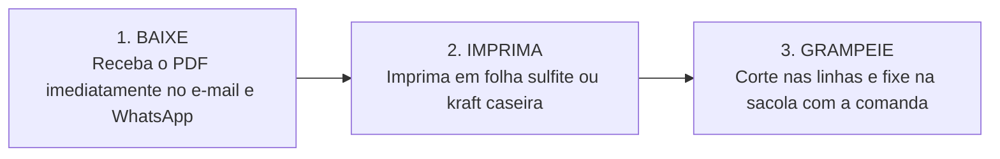

# PRD: Página de Vendas — Kit 365 Versículos para Delivery

> **Produto:** Kit 365 Versículos para Delivery *(Arquivo Digital em PDF de Alta Resolução)*  
> **Modelo de Conversão:** Low Ticket No-Brainer (R$ 19,90) • Estratégia Batata Mania 2026  
> **Status:** Atualizado com novos direcionamentos de layout e bônus  

---

## 1. Objetivo da Página de Vendas

### 🎯 Objetivo Primário
Converter donos de delivery e microempreendedores de alimentação em compradores imediatos do **Kit 365 Versículos para Delivery** pelo valor *no-brainer* de **R$ 19,90**, viabilizando *breakeven* de tráfego pago e aquisição contínua de clientes.

* **Aquisição de Clientes Qualificados (EQLs):** Transformar seguidores e visitantes frios em compradores ativos (ativos VIP), iniciando o relacionamento para futuras esteiras de produtos B2B.
* **Tangibilização Radical:** Apresentar o PDF como uma ferramenta física de bancada pronta para imprimir, cortar e grampear nos pedidos, afastando qualquer percepção de e-book teórico.
* **Experiência sem Fricção:** Proporcionar uma leitura fluida, dinâmica e *mobile-first*, com pouca carga textual e foco absoluto na demonstração prática.

---

## 2. Público-Alvo (Persona) e Dores que o Produto Resolve

| Dimensão | Descrição Detalhada |
| :--- | :--- |
| **Perfil da Persona** | Donos de delivery (batata recheada, marmitarias, hamburguerias, docerias, confeitarias, lanches, pizzarias e açaí) e microempreendedores que operam com entregas em sacolas e embalagens descartáveis. |
| **Rotina Operacional** | Rotina corrida na cozinha, cuidando simultaneamente do preparo dos pratos, montagem, selagem, embalagem e atendimento aos clientes. |
| **Valores & Cultura** | Empreendedores que valorizam a fé, o acolhimento e o carinho como formas de diferenciação e propósito. |

### 💥 Dores Centrais & Ruminação Mental
* **Delivery Frio e Commodity:** Medo constante de perder clientes para a concorrência por entregar uma experiência puramente transacional e sem afeto.
* **Falta de Tempo na Rotina:** Vontade genuína de enviar mensagens de bênção e carinho, mas sem tempo para pesquisar, redigir e diagramar 365 mensagens do zero todos os dias.
* **Custo Elevado de Brindes:** Dificuldade em gerar encantamento no pós-venda sem encarecer o custo unitário do pedido.

> [!TIP]
> **Proposta de Valor Central:**  
> *"Leve a Palavra de Deus através do seu empreendedorismo e fidelize seus clientes."*  
> Transforma cada entrega em um canal de afeto e conforto espiritual, gerando conexão emocional profunda, recompra espontânea e indicações com custo de centavos por pedido.

---

## 3. Arquitetura & Estrutura de Seções

1. **Header / Barra de Navegação:** Logo oficial do produto + Links âncora de navegação *(sem botão de compra)*.
2. **Hero Section (Layout Centralizado e Integrado):** Badge centralizado, Headline H1, Subheadline, Imagem do produto integrada ao fundo (sem moldura retangular) e Botão CTA posicionado abaixo da imagem.
3. **Vídeo Demonstrativo de Bancada (Seção Separada / YouTube Embed 9:16):** Player vertical em proporção 9:16 dedicado para demonstração prática da montagem e corte via link do YouTube.
4. **Demonstração Dinâmica dos Versículos (Interativa):** Card interativo estilo bilhete de corte com alternância dinâmica de versículos em tempo real.
5. **Como Funciona em 3 Passos:** Fluxo operacional visual: *1. Baixe ➔ 2. Imprima ➔ 3. Grampeie*.
6. **Prova Social & Validação Real (Carrossel Interativo):** Carrossel de prints com conversas e reações reais de clientes recebendo os versículos.
7. **Super Bônus Exclusivo:** Imagem e detalhes do Template de Cartão de Agradecimento Editável no Canva + Videoaula prática.
8. **Oferta Irresistível (Pricing Box):** Caixa de oferta com ancoragem de preço (R$ 19,90), selo de garantia e botão de compra direta.
9. **Garantia Incondicional de 7 Dias:** Selo de Satisfação e Risco Zero.
10. **FAQ (Perguntas Frequentes) & Rodapé:** Acordeão interativo de dúvidas rápidas e rodapé minimalista.

---

## 4. Copywriting & Especificações de Cada Seção

### Seção 1: Header / Barra de Navegação
* **Estrutura:** 
  * Logo do produto à esquerda.
  * Menu de navegação à direita com links âncora: `Como Funciona`, `Versículos`, `Depoimentos`, `Bônus`, `Dúvidas`.
  * *(Aviso de Design: Sem botão de compra no cabeçalho).*

---

### Seção 2: Hero Section (Layout 100% Centralizado)

* **Disposição Hierárquica:**
  1. **Badge / Tag Superior (Centralizado):** `ARQUIVO DIGITAL PRONTO PARA IMPRESSÃO EM A4`
  2. **Headline Principal (H1 - Centralizada):**  
     # Leve a Palavra de Deus no seu delivery e fidelize seus clientes.
  3. **Subheadline (Centralizada):**  
     365 versículos prontos em PDF para imprimir em folha A4 comum, cortar e grampear nas suas sacolas o ano todo.
  4. **Bullet Points de Apoio (Centralizados):**
     * ✔ **100% diagramado** com linhas de corte precisas
     * ✔ **Layout econômico** (gasta o mínimo de tinta)
     * ✔ **Envio imediato** e acesso vitalício no seu e-mail
  5. **Imagem do Produto (Centralizada):** Imagem em destaque posicionada logo abaixo do texto. **Importante:** A imagem NÃO deve ficar presa dentro de um card ou retângulo; deve ficar solta e integrada harmonicamente ao fundo da página (`#F2EBE3`).
  6. **Call to Action (CTA Principal - Abaixo da Imagem):**
     * **Texto do Botão:** `QUERO MEU KIT 365 VERSÍCULOS • R$ 19,90`
     * **Microcopy de Segurança:** `🔒 Pagamento Único • Download Imediato • 7 Dias de Garantia`

---

### Seção 3: Vídeo Demonstrativo de Bancada (Seção Separada / YouTube Embed 9:16)

> [!IMPORTANT]
> **Especificação Técnica do Player de Vídeo:**  
> Seção autônoma e independente. Container centralizado configurado na proporção **Vertical 9:16 (Reels/Shorts/TikTok)** com largura máxima de ~360px, emoldurado com elegância e preparado para receber `<iframe>` embed do **YouTube**.

* **Tag Superior:** `VEJA COMO FUNCIONA NA PRÁTICA`
* **Título da Seção (H2):** Veja como é simples aplicar esse carinho na bancada do seu delivery.
* **Subtítulo de Apoio:** Dê o play e veja como transformamos uma folha A4 comum em dezenas de mensagens de bênção que encantam e fidelizam os clientes todos os dias.

#### 🎬 Estrutura do Vídeo (YouTube Embed Vertical 9:16)
* **00:00 - 00:06:** Close na folha A4 impressa e na tesoura cortando nas linhas pontilhadas.
* **00:07 - 00:18:** Colocação do bilhete na sacola kraft junto à comanda.
* **00:19 - 00:30:** Demonstração do feedback emocionante da cliente.
* **00:31 - 00:40:** Chamada para baixar o PDF e imprimir imediatamente.

* **Legenda / Destaque abaixo do vídeo:**  
  `✂ Imprima em qualquer impressora caseira • Economia total de tinta • Linhas guia de corte inclusas`

---

### Seção 4: Demonstração Dinâmica dos Versículos (Interativa)

* **Tag Superior:** `EXPERIMENTE A MENSAGEM`
* **Título da Seção (H2):** Veja como o seu cliente vai receber a Palavra
* **Subtítulo de Apoio:** Toque no botão abaixo para simular a bênção que acompanhará cada entrega do seu delivery.
* **Componente Interativo (Card de Bilhete de Bancada):**
  * Card com proporção de bilhete impresso, fundo Creme Suave (`#FAF6F0`), linhas pontilhadas de corte (`border-dashed`), tipografia elegante (*Playfair Display*) e referência bíblica destacada.
  * **Botão Interativo (JS):** *"Ver outro versículo"* / *"Sortear bênção"* que altera a passagem e a referência com transição suave (*fade/slide*).

---

### Seção 5: Como Funciona em 3 Passos Simples

* **Título da Seção (H2):** Praticidade máxima para a sua rotina na cozinha:

1. **1. BAIXE:** Receba o arquivo em PDF imediatamente no seu e-mail e WhatsApp após a compra.
2. **2. IMPRIMA:** Imprima em folha sulfite comum ou papel kraft na sua impressora caseira.
3. **3. GRAMPEIE:** Corte nas linhas indicadas e fixe na sacola com a comanda do pedido.

---

### Seção 6: Prova Social & Validação Real (Carrossel de Imagens)

* **Tag Superior:** `CLIENTES ENCANTADOS`
* **Título da Seção (H2):** O carinho que volta em forma de fidelização e recompra
* **Subtítulo de Apoio:** Veja a reação de quem recebe o pedido acompanhado de uma palavra de bênção:
* **Componente Visual:** **Carrossel Interativo de Imagens**
  * Exibição dinâmica dos prints das mensagens de WhatsApp e Direct do Instagram.
  * Navegação por setas (desktop) e arraste/swipe lateral com paginação de pontos (mobile).

---

### Seção 7: Super Bônus Exclusivo (Com Imagem do Cartão)

* **Layout:** Card em destaque com divisão em duas colunas (ou vertical no mobile) contendo a **Imagem/Mockup do Cartão de Agradecimento** ao lado do conteúdo descritivo.

| Bônus | Conteúdo & Descrição Visual | Valor Original | Condição |
| :--- | :--- | :---: | :---: |
| 🎁 **SUPER BÔNUS** | **Template de Cartão de Agradecimento Estratégico Editável no Canva + Videoaula Prática:** • Imagem/Mockup visual do cartão artesanal editável. • Modelo pronto e personalizável para adicionar sua logo, cores e redes sociais. • Videoaula passo a passo ensinando a editar no Canva gratuito e imprimir. | ~R$ 37,00~ | **GRÁTIS** |

---

### Seção 8: Oferta Irresistível (No-Brainer)

* **Tag Superior:** `CONDIÇÃO EXCLUSIVA DE LANÇAMENTO`
* **Título da Oferta:** Leve o Kit 365 Versículos + Super Bônus Hoje
* **Ancoragem de Preço:**  
  * De: ~R$ 47,00~  
  * **Por apenas: R$ 19,90**
* **Condições:** *Pagamento único • Sem mensalidades • Acesso Imediato e Vitalício*
* **Botão CTA:**  
  `SIM! QUERO ABENÇOAR MEU DELIVERY POR R$ 19,90`
* **Microcopy de Urgência:**  
  `⚡ Menos de R$ 0,06 por dia para fidelizar seus clientes o ano inteiro.`

---

### Seção 9: Garantia Incondicional de 7 Dias

> [!IMPORTANT]
> ### 🛡️ Garantia de Satisfação Risco Zero (7 Dias)
> Baixe o arquivo, imprima os versículos e teste na sua operação. Se por qualquer motivo você achar que o material não facilitou o seu dia a dia ou não gerou encantamento nos seus clientes, basta enviar um e-mail em até 7 dias e devolveremos **100% do seu dinheiro**. Sem perguntas e sem burocracia.

---

### Seção 10: FAQ (Perguntas Frequentes)

| # | Pergunta | Resposta |
| :-: | :--- | :--- |
| **1** | **Como recebo o material após a compra?** | O envio é 100% digital e automático. Imediatamente após a confirmação do pagamento, você recebe o link de download direto no seu e-mail e WhatsApp. |
| **2** | **Preciso de impressora profissional ou papel caro?** | Não! O arquivo foi diagramado para folhas A4 comuns (sulfite) ou papel kraft em qualquer impressora caseira simples, gastando o mínimo de tinta. |
| **3** | **Serve para qual nicho de delivery?** | Serve para todos os tipos: batata recheada, marmitarias, hamburguerias, confeitarias, docerias, lanches, pizzarias, açaí e negócios com entregas descartáveis. |
| **4** | **O acesso expira após algum tempo?** | Não. O acesso é vitalício. Você pode salvar os arquivos no computador ou celular e imprimir quantas vezes quiser ao longo dos anos. |

---

## 5. Identidade Visual e Especificações Técnicas de UI/UX

### 🎨 Paleta de Cores Oficial

| Aplicação | Nome da Cor | Código HEX | Amostra | Função Estratégica na Interface |
| :--- | :--- | :---: | :---: | :--- |
| **Primária (Dark)** | Marrom Cacau / Terra | `#4B3621` | 🟫 | Cor principal da marca, tipografia base, títulos, bordas estruturais e rodapé. Transmite aconchego e sabor artesanal. |
| **Secundária (Accent)** | Dourado / Amarelo Mostarda | `#E1AD01` *(Alt: `#C79801`)* | 🟨 | CTAs principais, gradientes de destaque, preços, badges e destaques cromáticos. Estimula o apetite e a ação imediata. |
| **Neutro de Fundo** | Off-White / Bege Creme | `#F2EBE3` | ⬜ | Fundo geral da página. Garante contraste suave sem o cansaço visual do branco puro. |
| **Apoio de Card** | Creme Claro / Areia | `#FAF6F0` | ◽ | Fundo de cards, caixas de bônus e módulos de depoimento. |

### ✍️ Tipografia Oficial

| Família Tipográfica | Pesos Utilizados | Aplicação na Página |
| :--- | :--- | :--- |
| **Playfair Display** *(Serif)* | Bold (700) e Black (900) | Headlines principais (Hero), títulos de seções e destaques de impacto/autoridade. |
| **Plus Jakarta Sans** *(Sans-serif)* | Medium (500), Bold (700) e Black (900) | Subtítulos, textos corridos, botões de ação (CTAs) e componentes de navegação. |
